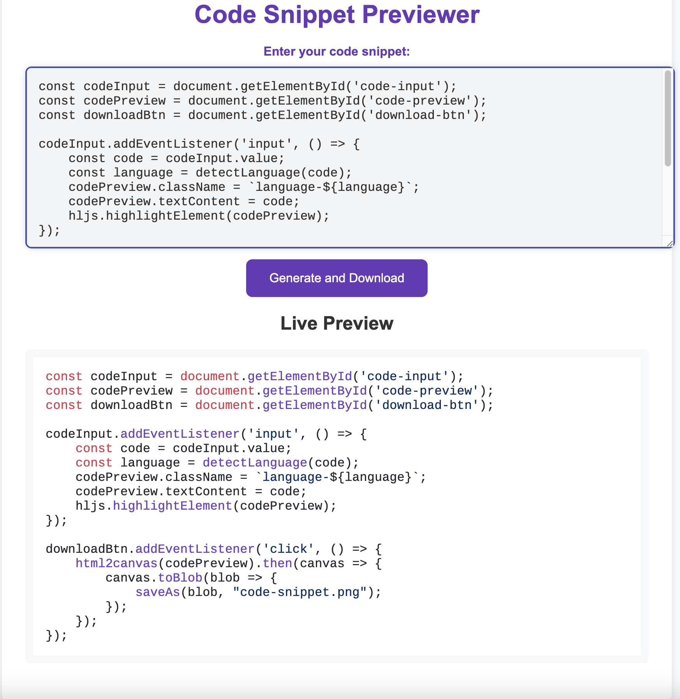

# Code Snippet Previewer

This project is a simple web application that allows users to preview and download code snippets as images. It uses Nginx as the web server.

## Features

- Live preview of code snippets with syntax highlighting
- Download code snippets as images
- Supports multiple programming languages

## Project Structure

```
snippits
├── Docktrerfile
├── README.md
├── data
│   ├── index.html
│   ├── script.js
│   └── styles.css
├── mime.types
└── nginx.conf
```


## Getting Started

### Prerequisites

- Docker

### Running the Application

1. Build the Docker image:

    ```sh
    docker build -t code-snippet-previewer .
    ```

2. Run the Docker container:

    ```sh
    docker run -p 8080:8080 code-snippet-previewer
    ```

3. Open your browser and navigate to `http://localhost:8080` to see the application.

## Screenshot



## License

This project is licensed under the MIT License.